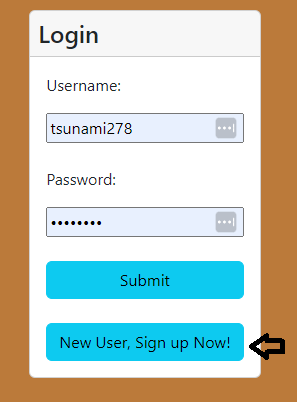
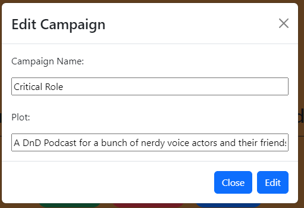
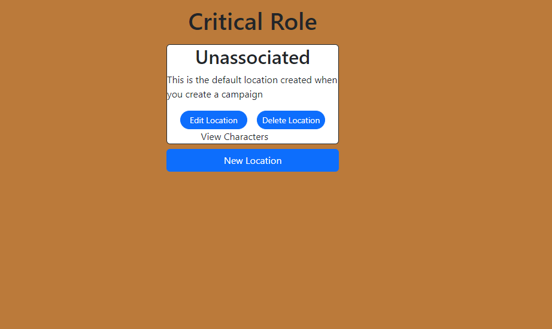
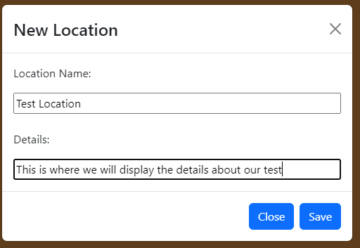
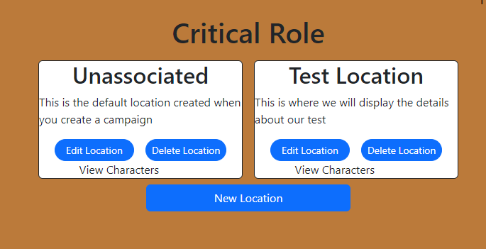
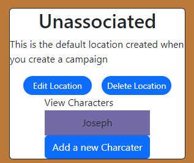
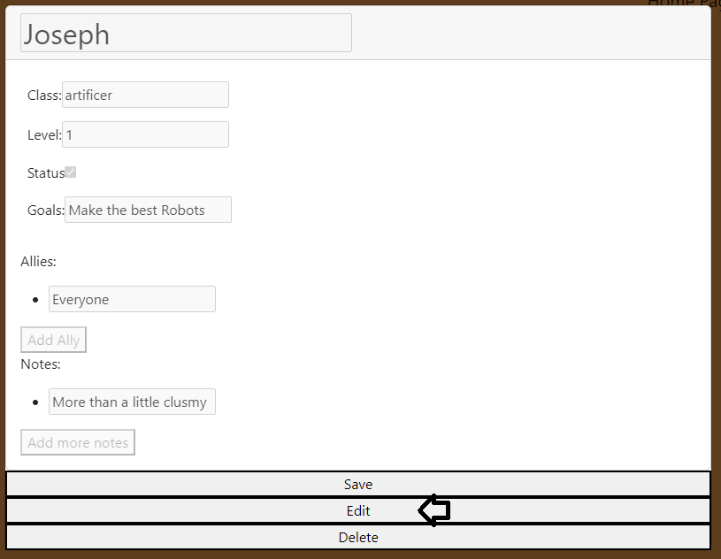
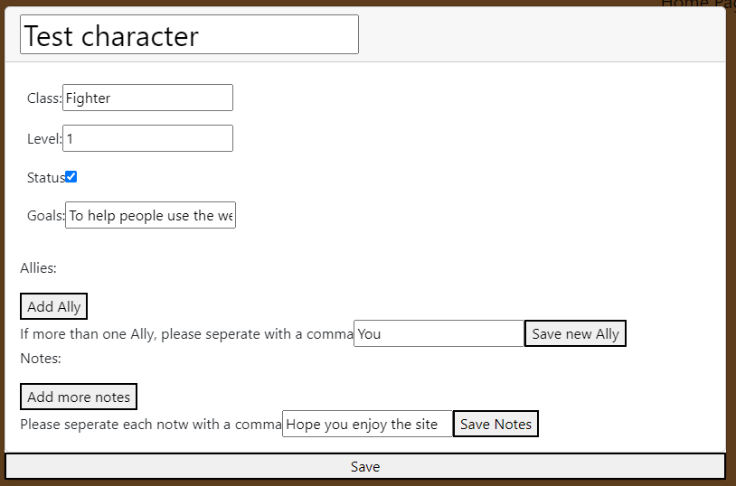
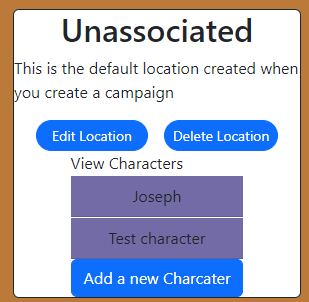

# MasterScrolls

## Description
A productivity board for DMs and GMs
## Installation
No installation is necessary in order to use the application. Please visit [this link](https://masterscrolls.herokuapp.com) in order to start using the application.
## Usage
In order to start using the webpage, you will need to create an account. If you already have one, then you just need to login. To start either of those processes click the login button on the top right of the screen.

Once you click there, you will be directed to a new page that will be default have a menu to login. If you still need to signup you can click the button at the bottom of the menu to change to the sign up menu.

After logging in or completing the sign up process you will be directed to the Campaign Library page. Your options at the top in the navbar will also have updated to reflect that you are logged in. The changes include a logout button and a button to direct back to the Campaign Library you are currently at.

The Campaign Library is where your created campaigns will be displayed. Initially after creating a new account you will not see any campaigns displayed. To create a campaign, click the New Campaign button displayed towards the center of the page. This will cause a modal to popup that will collect informations for your campaign.

Once you click save, your campaign will display in the center of the page. It contains 3 buttons: Edit Campaign, Delete Campaign, View Campaign.

Clicking the Edit Campaign button will cause a new modal to pop up with the input fields automatically filled in based on the selected campaign's data. Change the text in either field and clicking the Edit button will cause the changes to be saved and reflected on the Campaign Library page.

Clicking the Delete Campaign button will delete that campaign, causing it to disappear from your Campaign Library.

If you click View Campaign it will take you to a new page where you can create Locations and Characters for you campaign to organize and store information about them. By default all new campaigns will start with a single location called Unassociated where you can store characters that are not tied to a specific location.

On clicking the New Location button a modal will pop up to take input about the location. This includes a name and details about the location. Once you have filled in the desired information, clicking the save button will create a new card for that location.

Clicking the View Characters section will cause the location card to expand down and display the characters associated with that location.

Clicking on the section with the character will cause a modal to pop up to display their information. By default the fields will be locked, however, if you want to make changes to the character you can click the edit button towards the bottom to allow the edit of the fields

Clicking the save button will cause any changes made to be saved and close the modal. Clicking the delete button will delete that characters and remove them from your dispay.

If instead of viewing a character you want to create a new character, click the Add a new Character button that is on the location card. This will cause a similar modal as the character display to appear, however, it will be empty and editable from the get go. On save the newly created character will be added to the list of characters for the location.

## Credits

Charlee Gordan : [Github](https://github.com/cgordon5025) : [Linkedin](https://www.linkedin.com/in/charlee-gordon/)

Robin Allman : [Github](https://github.com/cod3burrito) : [Linkedin](https://www.linkedin.com/in/robin-allman-4787461b9/)

Christopher Tavares: [Github](https://github.com/cjtavares) : [Linkedin](https://www.linkedin.com/in/christopher-tavares-a67aa0238/)

Joseph Anderson : [Github](https://github.com/JosephFAnderson) : [Linkedin](https://www.linkedin.com/in/joseph-anderson-192827252/)

## License

This project is under an MIT License. 
